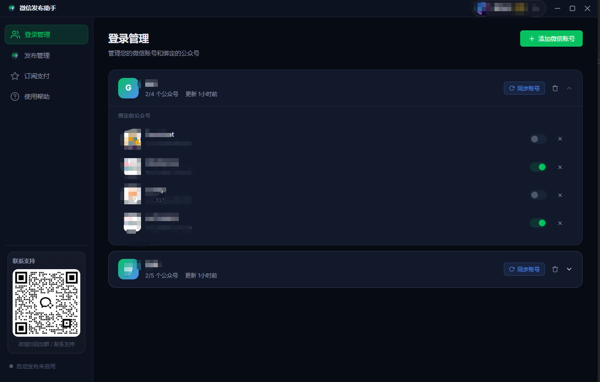
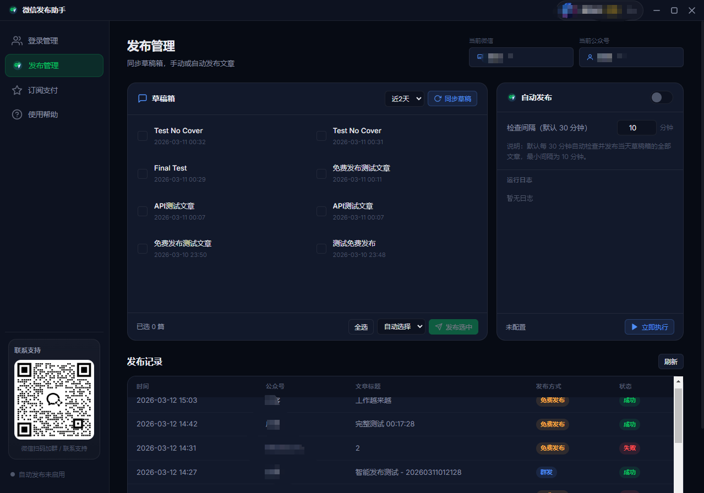
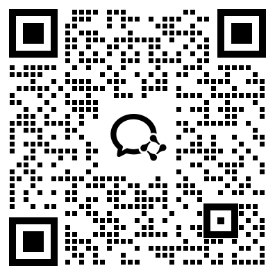

# 微信发布助手 v3（AI + 公众号 + 订阅号 + 自媒体 + 自动化）

> 面向公众号/订阅号/自媒体团队的发布自动化方案。

本项目聚焦一个目标：
**用 AI 与自动化流程，减少公众号运营中的重复劳动与人工失误。**

## 界面预览

---

---

## 下载与安装

### Git 上传后请跳转 Release 下载

- https://github.com/DNQtech/wechat_publiser/releases/tag/v1.0.0

---
## 联系我们

## 为什么值得你现在就试？

- 多账号公众号管理更清晰，适合订阅号矩阵运营
- 自媒体团队可快速标准化发布流程
- 自动化执行减少人工值守，提升内容分发效率
- AI 场景可扩展（选题、摘要、改写、排期）

---

## 适用人群

- 个人订阅号博主
- 公众号内容运营团队
- 自媒体代运营公司
- 需要“AI + 自动化”降本提效的内容业务

---

## 3 分钟快速体验

1. 进入「会员中心」切换身份（访客 / 普通用户 / VIP）
2. 到「登录管理」添加本地演示账号
3. 在「发布管理」同步草稿并执行手动发布
4. 开启自动发布，观察日志与发布记录变化

你会直观看到：公众号与订阅号运营，如何从“手动重复”升级到“自动化执行”。

---

## 关键词（便于搜索）

AI、公众号、订阅号、自媒体、自动化、内容运营、自动发布、批量发布、矩阵账号管理。

## 行动建议

如果你正在做公众号/订阅号/自媒体增长，建议先下载体验，再按团队流程落地自动化。

**把重复动作交给系统，把时间还给内容增长。**
